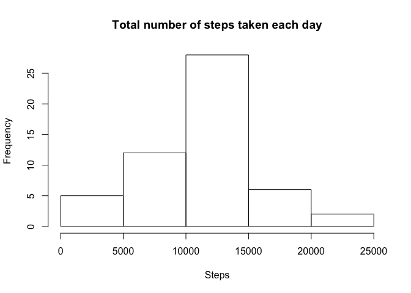
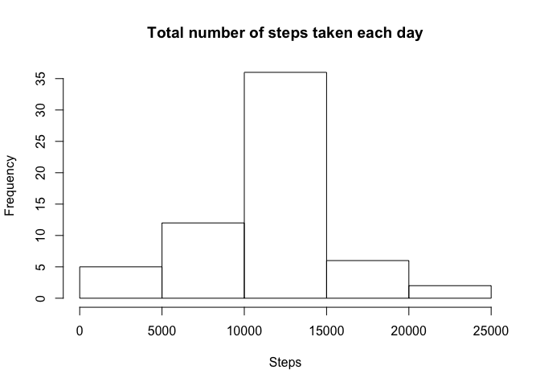
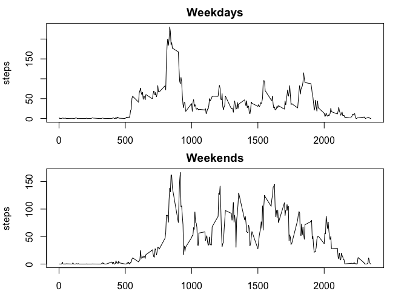

# Reproducible Research: Peer Assessment 1


## Loading and preprocessing the data


```r
df <- read.csv("activity.csv")
```

## What is mean total number of steps taken per day?

Mean total number of steps taken per day, ignoring the missing values in the dataset.
Histogram of the total number of steps taken each day:


```r
library(plyr)
df2_complete <- df[complete.cases(df),c(2,1,3)]
df2 <- ddply(df2_complete[,c(1,2)], .(date), 
      summarize, 
      steps = sum(steps))
hist(df2$steps, main="Total number of steps taken each day", xlab="Steps")
```

 

```r
mean1 <- sprintf("%.2f", mean(df2$steps))
median1 <- sprintf("%.2f", median(df2$steps))
```

The mean and median total number of steps taken per day are, respectively, 10766.19 and 10765.00.

## What is the average daily activity pattern?

Time series plot (i.e. type = "l") of the 5-minute interval (x-axis) and the average number of steps taken, averaged across all days (y-axis):


```r
df3 <- ddply(df2_complete[,c(2,3)], .(interval), 
             summarize, 
             steps = mean(steps))
plot(df3, type="l")
```

 

```r
row <- which.max(df3[,2])
interval <- df3[row,1]
st <- df3[row,2]
```

Which 5-minute interval, on average across all the days in the dataset, contains the maximum number of steps? Interval 835 with an average of 206.1698113 steps.

Total number of missing values in the dataset (i.e. the total number of rows with NAs): 


```r
totalNC <- sum(!complete.cases(df))
```

The total number of rows with NAs is 2304

## Imputing missing values

Filling in all of the missing values in the dataset using the mean of steps for that 5-minute interval. A new dataset that is equal to the original dataset but with the missing data filled in is created.


```r
df4 <- df
ind <- !complete.cases(df)
getSteps <- function(intval) df3$steps[df3$interval == intval] 
listSteps <- lapply(df4$interval[ind], getSteps)
df4$steps[ind] <- listSteps
df4$steps <- as.numeric(df4$steps)
```

Histogram of the total number of steps taken each day and the mean and median total number of steps taken per day.


```r
df5 <- ddply(df4[,c(2,1)], .(date), 
             summarize, 
             steps = sum(steps))
hist(df5$steps, main="Total number of steps taken each day", xlab="Steps")
```

 

```r
mean2 <- sprintf("%.2f", mean(df5$steps))
median2 <- sprintf("%.2f", median(df5$steps))
```

The mean and median total number of steps taken per day after filling in all of the missing values in the dataset using the mean of steps for that 5-minute interval are, respectively, 10766.19 and 10766.19

## Are there differences in activity patterns between weekdays and weekends?

A new factor variable in the dataset with two levels – “weekday” and “weekend” indicating whether a given date is a weekday or weekend day is added.


```r
df4$day <- ifelse(weekdays(as.Date(df4$date)) == "Saturday" | 
                    weekdays(as.Date(df4$date)) == "Sunday", "Weekend", "Weekday")
df4$day <- as.factor(df4$day)
```

Panel plot containing a time series plot (i.e. type = "l") of the 5-minute interval (x-axis) and the average number of steps taken, averaged across all weekday days or weekend days (y-axis).


```r
df4Weekend <- ddply(df4[df4$day == "Weekend",c(1,3)], .(interval), 
                    summarize, 
                    steps = mean(steps))    
df4Weekday <- ddply(df4[df4$day == "Weekday",c(1,3)], .(interval), 
                    summarize, 
                    steps = mean(steps))

par(mfrow=c(2,1),mar=c(2,4,2,2))
plot(df4Weekday, type="l", main="Weekdays")
plot(df4Weekend, type="l", main="Weekends")
```

 

